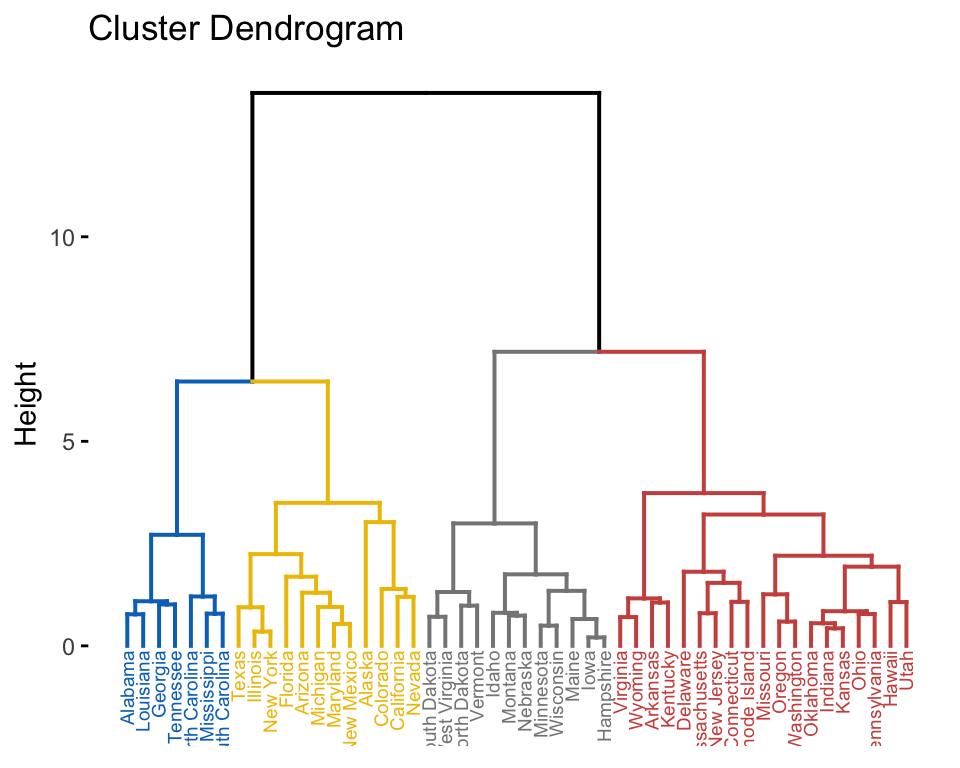
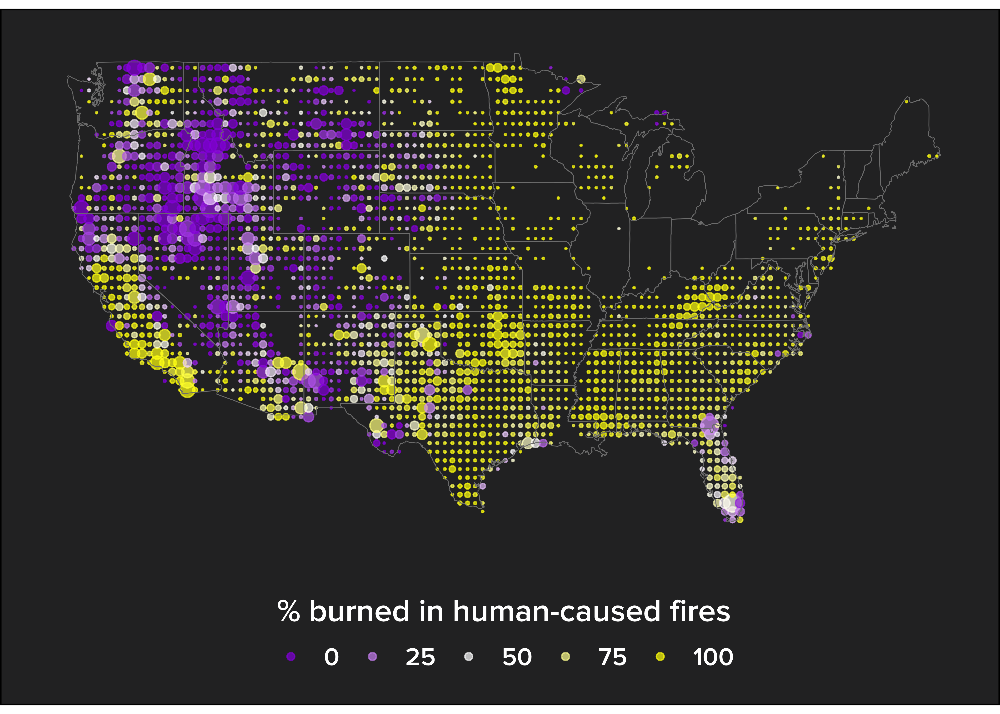

# Introduction to R for air quality applications - Data Visualization and ggplot2!

We will be introducing the incredibly powerful and popular ggplot2 package


```{r,out.width = "30%", echo=FALSE}

```


---

## Q & A

- Please submit questions in the question box.
- We will answer as many questions as possible during this webinar. If we can't get to your question, we will respond via email. 

```{r,out.width = "30%", echo=FALSE}
# placeholder - need to get attendee image
include_graphics("gotoweb_qbox.png")
```


---

## Today we'll discuss...

- what you can create with ggplot2,
- how to decide what kind of plot to make based on your data & research question,
- the components of a "Grammar of Graphics,"
- how the Grammar of Graphics philosophy can enable you to build custom, elegant plots,
- and where you can learn more.

---

## Purpose/Objectives

- Explore how NOx, O3, and SO2 have changed over a few months at Delaware monitoring sites
- Explore how patterns of change for each pollutant different?

---

## Data

We'll use 2017 monitoring data for three pollutants measured at the MLK AQS site in Delaware.

---

## What kind of plot should we make?

https://www.data-to-viz.com/ 

```{r,out.width = "90%", echo=FALSE}
include_graphics("DataToViz_snip.png")
```

---


# Examples of Charts in made in R

To whet everyones appetites, let's take a look at just what is possible with the ggplot package in R.
All of these visualizations were made in R, and their code is available online. 


```{r,out.width = "70%", echo=FALSE}
include_graphics("images/ggplot_masterlist_Diverging_bars.png")
```

---

```{r,out.width = "70%", echo=FALSE}
include_graphics("images/ggplot_masterlist_dot_plot.png")
```


---

```{r,out.width = "50%", echo=FALSE}
include_graphics("images/ggplot_masterlist_dumbbell.png")
```

---


# Specialty Charts

Here are some examples of charts that I can't imagine making in Excel...
(I'm not saying they're impossible, I'm saying I'd rather run a super marathon than even try)


---

```{r,out.width = "70%", echo=FALSE}
include_graphics("images/ggplot_masterlist_calendar_plot.png")
```


---


```{r,out.width = "55%", echo=FALSE}
include_graphics("images/ggplot_masterlist_heirarchical_dendrogram.png")
```


---


```{r,out.width = "55%", echo=FALSE}

```


---


```{r,out.width = "55%", echo=FALSE}
include_graphics("images/ggplot_masterlist_slope_chart_2.png")
```


# Time Series

Display and analysis of time series data can be a breeze in R. Here are some visualization examples. 


---


```{r,out.width = "70%", echo=FALSE}
include_graphics("images/ggplot_masterlist_time_series.png")
```


---


```{r,out.width = "70%", echo=FALSE}
include_graphics("images/ggplot_masterlist_time_series_2.png")
```


# Frequencies and Histograms

Statistics is the math of data, and R is the programing language of statistics. Here are some awesome frequency charts and histograms that are a breeze to construct in R.


---


```{r,out.width = "70%", echo=FALSE}
include_graphics("images/ggplot_masterlist_bocplot.png")
```


---


```{r,out.width = "70%", echo=FALSE}
include_graphics("images/ggplot_masterlist_boxplot_with_fill.png")
```


---


```{r,out.width = "70%", echo=FALSE}
include_graphics("images/ggplot_masterlist_violin_plot.png")
```


---


```{r,out.width = "52%", echo=FALSE}
include_graphics("images/rgraphgallery_histogram_scatter.png")
```


---


```{r,out.width = "70%", echo=FALSE}
include_graphics("images/ggplot_masterlist_density_plot.png")
```


# You can even go spatial!

A lot of spatial analysis is done in R nowadays. It may not have all of the functionality of a GIS software, but spatial data is just a special case of data, and there are many advantages of using a statistical programming for analyzing this type of data.


---


```{r,out.width = "50%", echo=FALSE}
include_graphics("images/ggplot_masterlist_open_street.png")
```


---


```{r, out.width = "75%", echo=FALSE}

```


# How is this even possible?


---


```{r, out.width = "60%", echo=FALSE}
include_graphics("images/rgraphgallery_bb8.png")
```


---


```{r, out.width = "40%", echo=FALSE}
include_graphics("images/github_cutterkom_generative_art2.png")
```


---


```{r, out.width = "60%", echo=FALSE}
include_graphics("images/github_cutterkom_generative_art1.png")
```


# Data Prep

This code chunk includes our dependencies, and reads in our data and prepares it for analysis -namely, makes it tidy. 


```{r, include = FALSE}
#dependencies
library(png)
library(tidyverse)
library(knitr)
library(lubridate)

#data prep for the rest of the presentation.
dat <- read_csv("C2.1.1CONUSv16.0_2020_p_unit_level_activity_enhanced_v2-tg.csv") #using read_csv, from readr package, to read files
dat_ozone <- read_csv("MLK 2017 AQS data Tidy.csv")
NEI_totals_long <- read_csv("NEI_totals_long.csv")

dat_ozone_long <- dat_ozone %>% 
  pivot_longer(-DateTime, names_to = "Measure", values_to = "Values") #using the pipe operator and pivot longer to tidy my data

dat_ozone_long_daily_summer <- dat_ozone_long %>%
  filter(Measure == "o3", DateTime >= as.Date('2017-05-01') & DateTime <= as.Date('2017-10-01')) %>%  #more tidyverse verbs to prep data
  mutate(rolling_mean = zoo::rollmean(Values,
                                k = 8,
                                fill = NA,
                                align = "center")) %>% 
  group_by(Date = date(DateTime)) %>%
  summarise(max_day = max(rolling_mean, na.rm = TRUE)) %>% 
  ungroup()

dat_ozone_long_daily_annual <- dat_ozone_long %>%
  filter(Measure == "o3") %>%  #more tidyverse verbs to prep data
  mutate(rolling_mean = zoo::rollmean(Values,
                                k = 8,
                                fill = NA,
                                align = "center")) %>% 
  group_by(Date = date(DateTime)) %>%
  summarise(max_day = max(rolling_mean, na.rm = TRUE)) %>% 
  ungroup()
  
dat_long <- dat %>% 
  select(1:37) %>% 
pivot_longer(7:37, names_to = "Metric", values_to = "Values")


```


# Why Chart in R?

Who here has been frustrated with making charts or graphs in Excel??

Simple charts, with small data, are quick and easy in Excel. But you quickly bump into the limits of what it can do for you. 

In contrast, the possibilities are quite literally endless in R! 

A *few* of the advantages of charting in R

- Reproduceability (make the exact same plot with several/many datasets, by only changing one line of code. No need to "manually" remake the chart) (not joking, steal this code)

- Transparency - Anyone else can read it for themself

- Infinite Customizability - You can change quite literally every aspect of a chart. Excel only gives you a few basic options

- Work with big data

- publishable graphics - Excel is getting better with this, but it used to be many publications would not accept an Excel chart for publication


# Grammar of Graphics


The grammar of graphics is a conception of graphing by Leland Wilkinson, published in 1999. It was highly conceptual.

ggplot2 is an implementation of these concepts, developed by Hadley Wickham. There are some differences between Wilkinson and Wickham, but we won't be discussing things at that level of detail...


---


## Learning the grammar by doing 

- We will be discussing how to build visualizations in R using ggplot2. Ggplot2 builds charts using the grammar of graphics approach. 

- The grammar of graphics provides a layered approach to building a chart. 

- We will start with the 3 obvious and common layers that are always required. There are actually 8 layers, but most of them have sensible defaults, and often don't need to be specified.  


# Required layer 1 - Data


```{r} 
#Starting with the AQS data
ggplot(dat_ozone)
```

The first necessary item is the **dataset** you want to chart. In this instance, we will be starting with the AQS data that we used in the open-air webinar.

Here, we passed the dataset("dat_ozone") as the first argument to ggplot.


---


Also, remember, since the data is the first argument, we can also pipe the dataset into ggplot

```{r}
dat_ozone %>% 
  ggplot()
```

This provides the first requirement, but of course, doesn't actually build a chart yet. It's sort of like having data in a table in Excel - it's necessary, but insufficient!


# Required Layer 2 - Aesthetics


Next, you will define some aesthetic mappings to ggplot. 

```{r}
ggplot(dat_ozone, aes(x = DateTime, y = o3))
```


This looks like an empy plot, too, but what have we actually accomplished here?


---


In ggplot2 in R, you build a data visualization piece by piece.The first call just supplies the dataset, but provides no mapping. That is why you get an empty/gray square. However, once we have supplied "aes()", we have mapped our x and y variables. This then also provides the **scale** to ggplot, which is why our x and y axes have both a label, **and** a range! 

(this is a fine detail, but actually important. With one mapping - the call to aes() - we have provided multiple required layers!)

However, we don't have any data actually plotted yet! That is because we have not provided a "geom", or a geometric object to map onto the chart. 


# Required Layer 3 - Geometries!

The part of a chart that everyone is familir with is the geometry, or the "geom", in ggplot2-speak. This defines the "type" of chart, in the sense of bar charts vs. line charts vs. scatterplots, etc. 

We'll start with a scatterplot, whose associated geometry, or geom, is "geom_point"

```{r}
ggplot(dat_ozone, aes(x = DateTime, y = o3)) + #Add layers and components to gpglots with '+'
  geom_point() #our geom for this plot

```

---

Let's talk through this output. First to note - we recieved a warning symbol - the message being, "Removed 107 rows containing missing values (geom_point)". Remember in the "working with data" webinar, that R takes missing data *VERY* seriously. 

The sort of "catch-all" way to remove NA values from your commands is, "na.rm = TRUE". So, if we pass that to the geom call, we will get the same result, but without the warning.


```{r}
ggplot(dat_ozone, aes(x = DateTime, y = o3)) +
  geom_point(na.rm = TRUE)
```


---


So, we have a scatterplot geom that has been mapped onto the exact chart space we had before we called a geometry. Remember, our aes() call supplied the scale, and the geom just maps the data onto the geometric object we specified. But, this scatterplot isn't so great. The first issue is that each day has 24 points, and we're mapping an entire year. That's just too much data to make sense of in this way.


Let's take a look at how we might subset this data, and just look at the summer ozone season.


We will be using more of the skills we learned in the "working with data" webinar! We will pipe the dataset to the filter "verb", and select only the DateTimes after May 1 AND before Oct 1. 


```{r, fig.width= 10, fig.height= 6}
dat_ozone %>% 
  filter(DateTime >= as.Date('2017-05-01') & DateTime <= as.Date('2017-10-01')) %>% 
  ggplot(aes(x = DateTime, y = o3)) +
  geom_point(na.rm = TRUE)

```


# types/ options of geometries
There are many geometries - because there are many types of charts! A short list is here:

* geom_point
* geom_bar
* geom_col
* geom_line
* geom_area
* geom_histogram
* geom_boxplot


For more, I recommend looking at the gpglot2 cheat sheet, in the resources section, or the ggplot2 website.


# Adding multiple geoms!

```{r, warning = FALSE, fig.width= 10, fig.height= 6}
dat_ozone %>% 
  filter(DateTime >= as.Date('2017-05-01') & DateTime <= as.Date('2017-10-01')) %>% 
  ggplot(aes(x = DateTime, y = o3)) +
  geom_point(na.rm = TRUE) +
  geom_smooth(method = lm)

```

While a linear model line plotted on this dataset isn't actually that informative, it shows that you can build more complex R charts by adding geoms to your plot! In this case, there are two geoms - point and smooth.


# More on Aesthetics

I wanted to talk a little more about this "aesthetic" mapping, and how to do in in ggplot.

In all the above code, we defined the aes() call in the intial ggplot call. Like this:

```{r, include = TRUE, warning=FALSE}
ggplot(dat_ozone, aes(x = DateTime, y = o3)) +
  geom_point(na.rm = T)
```


---

However, looks what happens when we move the aes() call to the geom, like this:

```{r}
dat_ozone %>% 
ggplot() +
  geom_point(aes(x = DateTime, y = o3), na.rm = TRUE)
```

---


It looks exactly the same!
What's happening here?

When you call aes() in the ggplot() call, it will pass that aesthetic mapping to all geoms that you call later, unless you specify a different aes() in that geom. 

---


Some examples:

```{r, warning=FALSE}
dat_ozone %>% 
  filter(DateTime >= as.Date('2017-05-01') & DateTime <= as.Date('2017-10-01')) %>% 
  ggplot(aes(x = DateTime, y = o3)) +
  geom_point(na.rm = TRUE) +
  geom_smooth(method = lm)

#same as:
dat_ozone %>% 
  filter(DateTime >= as.Date('2017-05-01') & DateTime <= as.Date('2017-10-01')) %>% 
  ggplot() +
  geom_point(aes(x = DateTime, y = o3), na.rm = TRUE) +
  geom_smooth(aes(x = DateTime, y = o3), method = lm)


```


---


We see the two ways of calling aes() here, and both charts are exactly the same! 
So why would you want to call aes() in the geom, instead of in the ggplot call?

well, if you wanted to plot different things to different geoms!


---


```{r, fig.width= 10, fig.height= 6}
dat_ozone %>% 
  filter(DateTime >= as.Date('2017-05-01') & DateTime <= as.Date('2017-10-01')) %>% 
  ggplot(aes(x = DateTime, y = o3)) +
  geom_point(na.rm = TRUE) +
  geom_line(data = dat_ozone_long_daily_summer, aes(x = as.POSIXct(Date), y = max_day), color = "red", size = 1.2) #we are using a different dataset and aes mapping for this geom

dat_ozone %>% 
  filter(DateTime >= as.Date('2017-05-01') & DateTime <= as.Date('2017-10-01')) %>% 
  ggplot(aes(x = DateTime, y = o3)) +
  geom_point(na.rm = TRUE) +
  geom_point(data = dat_ozone_long_daily_summer, aes(x = as.POSIXct(Date), y = max_day), color = "red", size = 3, shape =17)

```


Forget, for a moment, that this is an ugly chart, and focus, rather on what we accomplished. We were able to map two different gemoetries onto the same chart! 


# Statistics

There is another layer that we haven't talked about yet. The Statistic layer. This is often overlooked, as the geom you use tends to do this correctly behind the scenes. However, sometimes your chart won't work correctly, and it's because the statistical transformation that ggplot is trying to do can't be done the way you told it to.

For example, a Bar chart. The numbers the bar chart is plotting are not numbers reported in the dataset. There is an underlying calculation happening - it counts the rows and plots THAT number. 

---

```{r}
dat_ozone_long %>% 
  filter(DateTime >= as.Date('2017-05-01') & DateTime <= as.Date('2017-10-01')) %>% 
  ggplot(aes(x = Measure)) +
  geom_bar()
```


For instance, what we have shown with this barchart is that there are ~3700 measurements for each "Measure" in our dataset. What geom_bar did was *count* the rows of each measure, and then plot that count. The default statistic for geom_bar is "count".

Proof: 
```{r}
?geom_bar
```

Also notice that we only fed the geom_bar an x aesthetic - that's because you can't map a y aesthetic. For instance:


---


```{r}
# same exact code, but with a y aes mapped
# dat_ozone_long %>%
#   filter(DateTime >= as.Date('2017-05-01') & DateTime <= as.Date('2017-10-01')) %>%
#   ggplot(aes(x = Measure, y = Values)) +
#   geom_bar()
```
The error says, "Error: stat_count() can only have an x or y aesthetic." The stat that bar charts use is, "stat_count", and it can't use that y aes!


---


Another stat that is being done behind the scenes is in a histogram.

```{r, warning= FALSE}
dat_ozone_long %>% 
  filter(DateTime >= as.Date('2017-05-01') & DateTime <= as.Date('2017-10-01'), Measure == "o3") %>% 
  ggplot(aes(x = Values)) +
  geom_histogram() +
  scale_y_continuous(limits = c(0, 400), expand = c(0,0)) + #commands to set the scale manually. This also removed the whitespace below "0" and above the x axis. Try removing it and see for yourself. 
  labs(title = "Ozone values histogram")
#?geom_histogram - You can see in the documentation that the stat being done is, "bin". 
```
In this example, we are weven given a a response from the system, saying, "`stat_bin()` using `bins = 30`. Pick better value with `binwidth`". This is because we didn't povide a binwidth for the histogram, so the stat used the default value of 30 bins. 

We won't dive more into statistics in charts in this webinar. However, you should be aware that it is an important layer of the grammar of graphics, and you will become more familiar with them as you chart more. 


# Facets

Another layer that can be added to a ggplot visualization is a facet. 


```{r, fig.width=10, warning= FALSE}
dat_ozone_long %>% 
  filter(Measure == c("o3", "nox", "so2")) %>% 
  ggplot() +
  geom_point(aes(x = DateTime, y = Values, color = Measure)) +
  facet_wrap(~ Measure) + #this does the faceting! 
  theme_bw() +#this sets the theme to black and white, making a cleaner plot
  guides(colour = guide_legend(override.aes = list(size=5))) #this changes the size of the points in the legend!

```
What is this beautiful chart!?
This is a three-panel faceted chart of our dat_ozone_long dataset. We have faceted on the Measure, or pollutant, variable. But why are O3 and SO2 at zero?
It's because the three facets share the same Y axis. When you facet a chart, you are usually doing it to compare across facets. This means that you **should** share a Y axis. 


---


In this case, it doesn't make sense, because the pollutants have different concentrations. We can "free" the Y axis, so there is a seperate Y axis for each facet. BUT! We should make sure to draw the reader's attention to the Y - that way, no one can accuse us of deceptive chart practices!

```{r, fig.width=10, warning= FALSE}
dat_ozone_long %>% 
  filter(Measure == c("o3", "nox", "so2")) %>% 
  ggplot() +
  geom_point(aes(x = DateTime, y = Values, color = Measure)) +
  facet_wrap(~ Measure, scales = "free_y") + #this does the faceting! and "free_y" allows a different Y axis for each facet. 
  theme_bw() +#this sets the theme to black and white, making a cleaner plot
  guides(colour = guide_legend(override.aes = list(size=5))) + #this changes the size of the points in the legend!
  labs(title = "Daily pollution concentrations in 2017",
       subtitle = "Each chart has seperate y-axis of concentration")
```


---


Let's do another example of a faceted chart. This time, we used mutate to create some new variables, then faceted on those variables (month and day of month).

```{r, fig.height=9, fig.width= 10, warning= FALSE}
Calendar_plot <- dat_ozone_long %>% 
  mutate("Month" = month(DateTime, label = T),
         "Day of Month" = mday(DateTime)) %>% #these two lines create a "month" to facet on, and a "day of month" for the x axis
  filter(Measure == "o3") %>% # I just want to plot Ozone
  ggplot() +
  geom_point(aes(x = `Day of Month`, y = Values), color = "orange") +
  facet_wrap(~ Month) +
  theme_bw() +
  labs(title = "Monthly Ozone values in 2017",
       y = "Ozone ppm")


Calendar_plot

#add break points of AQI in point colors
```


---


A second example. Instead of using hourly values, let's map the year in daily 8-hour max ozone values, and color code the values based on AQI.

```{r, fig.height=6}
Calendar_plot_2 <-  dat_ozone_long_daily_annual %>% 
  mutate("Month" = month(Date, label = T),
         "Day of Month" = mday(Date)) %>%  
  ggplot() +
  geom_point(aes(x = `Day of Month`, y = max_day, color = cut(max_day, c(-Inf, .054, .071, .086, .106)))) +
  facet_wrap(~ Month) +
  theme_bw() +
  labs(title = "Daily 8-hour Max Ozone Values in 2017",
       y = "Ozone ppm") +
  scale_color_manual(name = "AQI",
                     values = c("green", "yellow", "orange", "red"),
                     labels = c("green", "yellow", "orange", "red"))
Calendar_plot_2
```


# Coordinate system

The concept of a coordinate system may not be something you have thought about before. 
Taken from, "ggplot2: Elegant Graphics for Data Analysis" by Hadley Wickham,

"Coordinate systems have two main jobs:

* Combine the two position aesthetics to produce a 2d position on the plot. The position aesthetics are called x and y, but they might be better called position 1 and 2 because their meaning depends on the coordinate system used. For example, with the polar coordinate system they become angle and radius (or radius and angle), and with maps they become latitude and longitude.

* In coordination with the faceter, coordinate systems draw axes and panel backgrounds. While the scales control the values that appear on the axes, and how they map from data to position, it is the coordinate system which actually draws them. This is because their appearance depends on the coordinate system: an angle axis looks quite different than an x axis.


---


"There are two types of coordinate system. Linear coordinate systems preserve the shape of geoms:

* coord_cartesian(): the default Cartesian coordinate system, where the 2d position of an element is given by the combination of the x and y positions.

* coord_flip(): Cartesian coordinate system with x and y axes flipped.

* coord_fixed(): Cartesian coordinate system with a fixed aspect ratio.


---


I use the coord_flip a lot, to make charts like this:

```{r,out.width = "70%", echo=FALSE}
include_graphics("images/ggplot_masterlist_Diverging_bars.png")
```


---


It's really helpful to flip your bar chart if you have long titles for your factors. 
And the code for this plot:
```{r, fig.width=8}
# Data Prep
data("mtcars")  # load data
mtcars$`car name` <- rownames(mtcars)  # create new column for car names
mtcars$mpg_z <- round((mtcars$mpg - mean(mtcars$mpg))/sd(mtcars$mpg), 2)  # compute normalized mpg
mtcars$mpg_type <- ifelse(mtcars$mpg_z < 0, "below", "above")  # above / below avg flag
mtcars <- mtcars[order(mtcars$mpg_z), ]  # sort
mtcars$`car name` <- factor(mtcars$`car name`, levels = mtcars$`car name`)  # convert to factor to retain sorted order in plot.

# Diverging Barcharts

ggplot(mtcars, aes(x=`car name`, y=mpg_z, label=mpg_z)) + 
  geom_bar(stat='identity', aes(fill=mpg_type), width=.5)  +
  scale_fill_manual(name="Mileage", 
                    labels = c("Above Average", "Below Average"), 
                    values = c("above"="#00ba38", "below"="#f8766d")) + 
  labs(subtitle="Normalised mileage from 'mtcars'", 
       title= "Diverging Bars") + 
  coord_flip() #try it without the coord_flip! It's awful...
```


---


"On the other hand, non-linear coordinate systems can change the shapes: a straight line may no longer be straight. The closest distance between two points may no longer be a straight line.

* coord_map()/coord_quickmap()/coord_sf(): Map projections.

* coord_polar(): Polar coordinates.

* coord_trans(): Apply arbitrary transformations to x and y positions, after the data has been processed by the stat.


---


coord_polar:

```{r}
rect <- data.frame(x = 50, y = 50)
line <- data.frame(x = c(1, 200), y = c(100, 1))
base <- ggplot(mapping = aes(x, y)) + 
  geom_tile(data = rect, aes(width = 50, height = 50)) + 
  geom_line(data = line) + 
  xlab(NULL) + ylab(NULL)
base
base + coord_polar("x")
base + coord_polar("y")

```


# Let's talk about labels


Chart labels, that is!

You should always label your charts, to make them easy to understand for your audience. Ggplot has numerous ways to add labels, but the easiest is probably with the "labs" 

```{r, fig.width= 10, fig.height= 6}
dat_ozone %>% 
  filter(DateTime >= as.Date('2017-05-01') & DateTime <= as.Date('2017-10-01')) %>% 
  ggplot(aes(x = DateTime, y = o3)) +
  geom_point(na.rm = TRUE) +
  labs(title = "Hourly Ozone Concentrations",
       subtitle = "Time series chart for the summer of 2017",
        x = "Date",
        y = "Ozone (ppm)")
```


# Labeling points

Sometimes, especially with small datasets, it can be useful to label points directly. Here is one example of how to do that.


```{r}
df <- data.frame(trt = c("a", "b", "c"), resp = c(1.2, 3.4, 2.5))
ggplot(df, aes(resp, trt)) + 
  geom_point() + 
  geom_text(aes(label = paste0("(", resp, ")")), nudge_y = -0.25) + 
  xlim(1, 3.6)
```


---


There are other packages that may help to make more custom annotations. One example - What if I wanted to add "DRAFT" over the graphic?

```{r, fig.height=8, warning = FALSE}
library(cowplot)

ggdraw(Calendar_plot) + 
  draw_label("Draft", color = "#C0A0A0", size = 200, angle = 45, alpha = .5) #alpha is transparency
```


# Wrap-up

Now, you have been introduced into the world of Grammar of Graphics. It may seem daunting, but that's only because it forces you to think a little but more about your charts. Which, in the end, is a good thing! Excel makes charting "easy"... until it isn't. Then making changes to charts in Excel is impossible.

R completely frees you up, to do almost anything with (or to) your charts! 


---


The only thing left to do is practice! You can practice with the datasets in this presentation, or better yet, use some data that matters to you. 

Charting is sometimes thought of as a "last step" of data analysis. However, for me, it's actually one of the first things that I do. If I have a new dataset, and I want to get to know it, there is no more efficient way than to start charting it!


# Resources 

Ggplot2 cheat sheet
https://rstudio.com/wp-content/uploads/2016/11/ggplot2-cheatsheet-2.1.pdf


# Extras


Ploty- make interactive plots with plotly (by just passing your ggplot to plotly!)

```{r}
#install.packages("plotly")
library(plotly)
plotly_ex <- dat_ozone %>% 
  filter(DateTime >= as.Date('2017-05-01') & DateTime <= as.Date('2017-10-01')) %>% 
  ggplot(aes(x = DateTime, y = o3)) +
  geom_point(na.rm = TRUE) +
  labs(title = "Hourly Ozone Concentrations",
       subtitle = "Time series chart for the summer of 2017",
        x = "Date",
        y = "Ozone (ppm)")

ggplotly(plotly_ex)

```


---


Something I wanted to show everyone. It was about 1.5 years into my R education when I really started using functions, so it isn't something I expect anyone to be able to do now. BUT! This function is a really cool way to loop over all your variables, and make plots for each variable. I use it in data exploration a lot. 

```{r, fig.width=9, fig.height=5}
#Let's write a function that lets us iterate over the pollutants, and make a new chart for each pollutant

Pollutants <- (NEI_totals_long %>% 
  distinct(NEI_totals_long$Pollutant))
Pollutants <- Pollutants[[1]]


plot_pols = function(df, pol){ #this is the function, with 2 inputs
    for(pol in Pollutants){ #this is the for loop, to loop over a list of pollutants
        p = ggplot(NEI_totals_long %>%  #this is the ggplot call I want to perform for each "pol"
                    filter(.data$Pollutant == pol)) +
            geom_line(aes(x = factor(Year), y = `Tons per Year`, color = Sector, group = Sector), size = 1.2) +
            geom_point(aes(x = factor(Year), y = `Tons per Year`, color = Sector), size = 2) +
            scale_fill_brewer(palette = "Set2") +
            labs(title = paste0(pol," Annual Tons, by Sector")) +
            scale_x_discrete(expand = expansion(mult = c(0.01, 0.05)))+
            theme_bw()
        print(p)
    }
}

plot_pols(NEI_totals_long, Pollutants)

```


# Notation for pollutants, scientific, etc. 

In R, you ay want to include scientific notation for your pollutants - such as subscript or superscript symbols for chemical names. There are two examples below - I have added comments to the relevent lines.

```{r}
ggplot(NEI_totals_long %>% 
                    filter(Pollutant == "NH3")) +
            geom_line(aes(x = factor(Year), y = `Tons per Year`, color = Sector, group = Sector), size = 1.2) +
            geom_point(aes(x = factor(Year), y = `Tons per Year`, color = Sector, shape = Sector), size = 3) +
            scale_colour_brewer(palette = "Set1") +
            labs(title = bquote(~NH[3]~"Annual Tons, by Sector"), x = "Year") + #use bquote and associated notation for subscript
            scale_x_discrete(expand = expansion(mult = c(0.01, 0.05)))+
            theme_bw() +
            theme(panel.grid.major.x = element_blank(),
            panel.grid.minor.x = element_blank()) +
            scale_y_continuous(labels=scales::comma) #use comma from the scales package to add a thousans seperator comma

ggplot(NEI_totals_long %>% 
                    filter(Pollutant == "PM10-PRI")) +
            geom_line(aes(x = factor(Year), y = `Tons per Year`, color = Sector, group = Sector), size = 1.2) +
            geom_point(aes(x = factor(Year), y = `Tons per Year`, color = Sector, shape = Sector), size = 3) +
            scale_colour_brewer(palette = "Set1") +
            labs(title = bquote(~PM[10]~"Primary Annual Tons, by Sector"), x = "Year") + #use bquote and associated notation for subscript
            scale_x_discrete(expand = expansion(mult = c(0.01, 0.05)))+
            theme_bw()+
            theme(panel.grid.major.x = element_blank(),
            panel.grid.minor.x = element_blank()) +
            scale_y_continuous(labels=scales::comma) #use comma from the scales package to add a thousans seperator comma
```

Further reading on bquote: https://trinkerrstuff.wordpress.com/2018/03/15/2246/